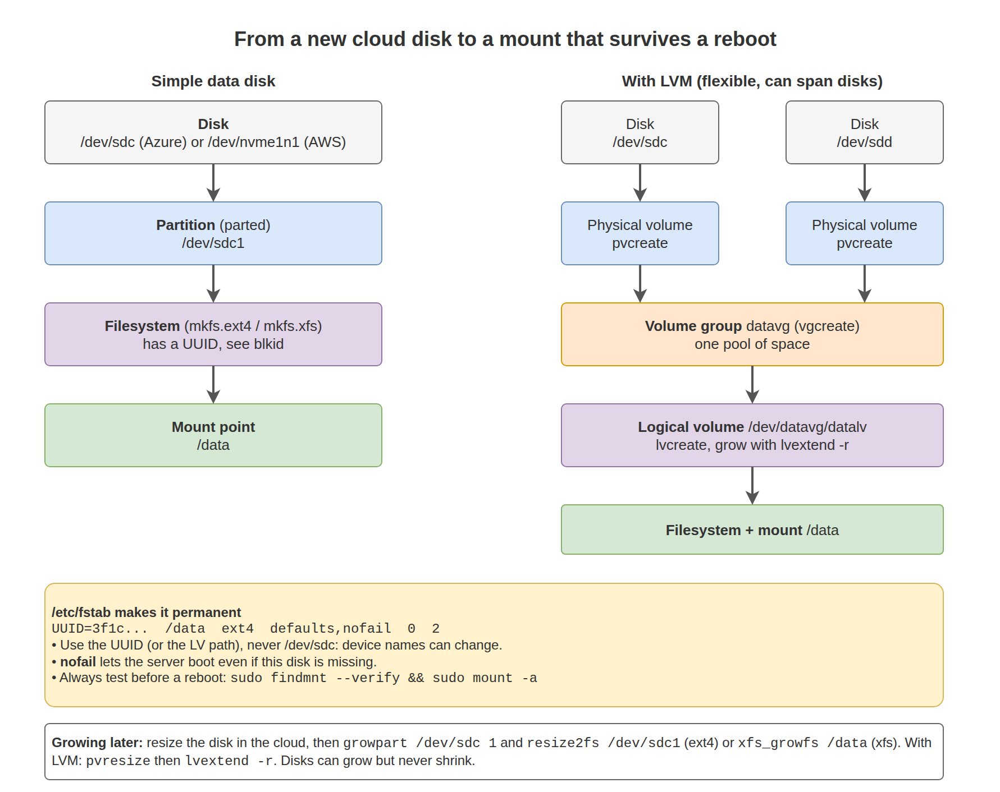

# 12. Storage and Filesystems

In the cloud you will add data disks, grow disks that are full, and recover servers that do not boot because of a bad mount. This chapter covers the full path from "a new disk is attached" to "it is mounted, survives a reboot, and can grow later".

## What you will learn

- Finding disks and understanding device names in Azure and AWS
- Partitioning, formatting, and mounting a new data disk
- Making mounts permanent with `/etc/fstab` without risking the boot
- Growing a disk and filesystem after resizing it in the cloud
- LVM for flexible storage
- Swap files and checking disk usage

## The layers



## Find your disks

```bash
lsblk -o NAME,SIZE,TYPE,FSTYPE,MOUNTPOINTS
```

Output (example, Azure VM with a new 32 GB data disk):

```text
NAME    SIZE TYPE FSTYPE MOUNTPOINTS
sda      30G disk
├─sda1 29.9G part ext4   /
├─sda14   4M part
└─sda15 106M part vfat   /boot/efi
sdb      16G disk
└─sdb1   16G part ext4   /mnt
sdc      32G disk
```

- `sda` is the OS disk.
- `sdb` is the Azure **temporary disk**, mounted at `/mnt`. Data on it is lost when the VM is stopped, resized, or moved. Never store anything important there.
- `sdc` has no partition and no filesystem: this is the new data disk.

### Device names in the cloud

| Platform | OS disk | Data disks | Stable way to identify |
|---|---|---|---|
| Azure (SCSI) | `/dev/sda` | `/dev/sdc`, `/dev/sdd` ... | `/dev/disk/azure/scsi1/lun0` = LUN 0 in the portal |
| Azure (NVMe VM sizes) | `/dev/nvme0n1` | `/dev/nvme0n2` ... | `lsblk`, `sudo nvme list` |
| AWS (Nitro instances) | `/dev/nvme0n1` | `/dev/nvme1n1` ... | Serial number = EBS volume ID |
| Google Cloud | `/dev/sda` or `/dev/nvme0n1` | next letters/numbers | `/dev/disk/by-id/google-<disk-name>` |

> Device names like `sdc` can change between reboots. **Never** put `/dev/sdc` in `/etc/fstab`. Use the filesystem UUID.

On AWS, match an NVMe device to its EBS volume:

```bash
lsblk -o NAME,SIZE,SERIAL
```

Output (example):

```text
NAME          SIZE SERIAL
nvme0n1         8G vol0a1b2c3d4e5f60718
nvme1n1        20G vol0f9e8d7c6b5a49382
```

`vol0f9e8d7c6b5a49382` is EBS volume `vol-0f9e8d7c6b5a49382`.

On Azure, match a LUN:

```bash
ls -l /dev/disk/azure/scsi1/
```

Output (example):

```text
lrwxrwxrwx 1 root root 12 Sep 23 11:20 lun0 -> ../../../sdc
```

## Add a data disk: step by step

The example uses `/dev/sdc`. Replace it with your device. **Check twice**: formatting the wrong disk destroys its data.

**1. Confirm the disk is empty**

```bash
sudo lsblk -f /dev/sdc
sudo wipefs /dev/sdc        # no output means no filesystem or partition signatures
```

**2. Create a partition table and one partition**

```bash
sudo parted /dev/sdc --script mklabel gpt mkpart data 0% 100%
lsblk /dev/sdc
```

Output:

```text
NAME   MAJ:MIN RM SIZE RO TYPE MOUNTPOINTS
sdc      8:32   0  32G  0 disk
└─sdc1   8:33   0  32G  0 part
```

**3. Create a filesystem**

```bash
sudo mkfs.ext4 -L data /dev/sdc1      # ext4, the Ubuntu default
# or
sudo mkfs.xfs -L data /dev/sdc1       # xfs, the RHEL default
```

| | ext4 | xfs |
|---|---|---|
| Default on | Ubuntu, Debian | RHEL, Rocky, Amazon Linux |
| Grow while mounted | Yes (`resize2fs`) | Yes (`xfs_growfs`) |
| Shrink | Yes, only unmounted | **No** |

**4. Mount it**

```bash
sudo mkdir -p /data
sudo mount /dev/sdc1 /data
df -h /data
```

Output:

```text
Filesystem      Size  Used Avail Use% Mounted on
/dev/sdc1        32G   24K   30G   1% /data
```

**5. Make it permanent with fstab**

Get the UUID:

```bash
sudo blkid /dev/sdc1
```

Output (example):

```text
/dev/sdc1: LABEL="data" UUID="3f1c2b8e-7d4a-4c1e-9b2f-0a1b2c3d4e5f" BLOCK_SIZE="4096" TYPE="ext4" PARTLABEL="data" PARTUUID="..."
```

Back up fstab, then add one line:

```bash
sudo cp /etc/fstab /etc/fstab.$(date +%F)
echo 'UUID=3f1c2b8e-7d4a-4c1e-9b2f-0a1b2c3d4e5f  /data  ext4  defaults,nofail  0  2' | sudo tee -a /etc/fstab
```

| Field | Value | Meaning |
|---|---|---|
| 1 | `UUID=...` | Which filesystem |
| 2 | `/data` | Where to mount it |
| 3 | `ext4` | Filesystem type |
| 4 | `defaults,nofail` | Options. `nofail` lets the server boot even if this disk is missing |
| 5 | `0` | Legacy dump flag, always 0 |
| 6 | `2` | fsck order: `1` for root, `2` for others, `0` to skip (use `0` for xfs) |

**6. Test fstab before you reboot**

```bash
sudo umount /data
sudo findmnt --verify
sudo mount -a
findmnt /data
```

Output of `findmnt /data`:

```text
TARGET SOURCE    FSTYPE OPTIONS
/data  /dev/sdc1 ext4   rw,relatime
```

If `mount -a` shows an error, fix `/etc/fstab` **now**. A bad fstab line without `nofail` can stop the VM from booting, and on a cloud VM you cannot simply walk up to the console. Recovery is in [22. Troubleshooting](../22-troubleshooting/README.md#server-does-not-boot-after-an-fstab-change).

**7. Set ownership for the application**

```bash
sudo chown myapp:myapp /data
```

## Grow a disk after resizing it in the cloud

After you increase the disk size in the portal or CLI (Chapters 19 to 21), Linux still sees the old partition and filesystem size. Three steps: rescan, grow the partition, grow the filesystem.

```bash
lsblk /dev/sdc                        # disk shows new size, partition does not
```

Output:

```text
NAME   SIZE TYPE MOUNTPOINTS
sdc     64G disk
└─sdc1  32G part /data
```

**1. Grow the partition** with `growpart` (package `cloud-guest-utils` on Ubuntu, `cloud-utils-growpart` on Red Hat family). Note the space between the disk and the partition number:

```bash
sudo growpart /dev/sdc 1
# NVMe example: sudo growpart /dev/nvme1n1 1
```

**2. Grow the filesystem**

```bash
sudo resize2fs /dev/sdc1        # ext4: use the device
sudo xfs_growfs /data           # xfs: use the mount point
df -h /data
```

Output:

```text
Filesystem      Size  Used Avail Use% Mounted on
/dev/sdc1        63G   24K   60G   1% /data
```

If the disk size itself did not change inside the VM, force a rescan:

```bash
echo 1 | sudo tee /sys/class/block/sdc/device/rescan
```

The **OS disk** grows the same way (`growpart /dev/sda 1`, then `resize2fs /dev/sda1` or `xfs_growfs /`). On most cloud images, cloud-init grows the root partition automatically at the next boot.

## LVM: flexible volumes

LVM puts a layer between disks and filesystems. You can combine disks, grow volumes, and take snapshots. Red Hat family images and many enterprise builds use it for the OS disk.

| Term | Meaning | Commands |
|---|---|---|
| PV (physical volume) | A disk or partition given to LVM | `pvcreate`, `pvs` |
| VG (volume group) | A pool made from one or more PVs | `vgcreate`, `vgextend`, `vgs` |
| LV (logical volume) | A slice of the pool that you format | `lvcreate`, `lvextend`, `lvs` |

Create a volume from two data disks:

```bash
sudo pvcreate /dev/sdc /dev/sdd
sudo vgcreate datavg /dev/sdc /dev/sdd
sudo lvcreate -n datalv -l 80%VG datavg
sudo mkfs.xfs /dev/datavg/datalv
sudo mkdir -p /data && sudo mount /dev/datavg/datalv /data
sudo vgs && sudo lvs
```

Output (example):

```text
  VG     #PV #LV #SN Attr   VSize  VFree
  datavg   2   1   0 wz--n- 63.99g 12.80g
  LV     VG     Attr       LSize  ...
  datalv datavg -wi-ao---- 51.19g
```

Grow the volume and filesystem in one command:

```bash
sudo lvextend -r -L +10G /dev/datavg/datalv
```

`-r` resizes the filesystem too. When the volume group is full, add another disk with `pvcreate` and `vgextend`, then extend again.

In fstab, you can refer to an LV by its path (`/dev/datavg/datalv`), which is stable, or by UUID.

## Swap

Cloud images usually have no swap. A small swap file protects small VMs from being killed when memory runs out briefly.

```bash
sudo fallocate -l 2G /swapfile
sudo chmod 600 /swapfile
sudo mkswap /swapfile
sudo swapon /swapfile
echo '/swapfile none swap sw 0 0' | sudo tee -a /etc/fstab
swapon --show
free -h
```

> On Azure, the Linux agent or cloud-init can create swap on the temporary disk instead of the OS disk. Swap is slower than memory. If a server uses swap constantly, it needs more RAM, not more swap.

## Checking usage

```bash
df -hT                                  # space per filesystem, with type
df -i                                   # inodes (number of files) per filesystem
sudo du -xh --max-depth=1 / | sort -h   # which top-level directories are large
sudo du -sh /var/* | sort -h | tail     # drill down
```

`ncdu` (`sudo apt install ncdu`) is an interactive version of `du` and makes finding large directories fast.

A filesystem can be "full" in two ways: no space (`df -h` at 100%) or no inodes (`df -i` at 100%, usually millions of tiny files).

## Lab: Data disk from zero to production

1. Attach a new 8 to 32 GB data disk to your VM (Chapter 19, 20, or 21).
2. Identify it with `lsblk` and, on Azure, `/dev/disk/azure/scsi1/`.
3. Partition, format as ext4, mount at `/data`, and add it to fstab by UUID with `nofail`.
4. Run `sudo findmnt --verify` and `sudo mount -a`.
5. Reboot and confirm `/data` is mounted: `findmnt /data`.
6. Resize the disk in the cloud, then grow the partition and filesystem without unmounting.
7. Record `df -h /data` before and after.

## Common problems

| Symptom | Cause | Fix |
|---|---|---|
| New disk not visible in `lsblk` | Not attached yet, or Azure LUN 0 missing. | Check the portal. `sudo dmesg -T \| tail`. |
| `mount: wrong fs type, bad option, bad superblock` | No filesystem, or wrong type. | `sudo blkid /dev/sdc1`. Format if new. |
| `mount -a` error after editing fstab | Typo or wrong UUID. | Fix before reboot. Compare with `blkid`. |
| `growpart: NOCHANGE: partition 1 is size ...` | Disk size inside the VM did not change. | Rescan (above), or check the resize finished in the cloud. |
| `resize2fs: Bad magic number` | Ran `resize2fs` on xfs. | Use `xfs_growfs /mountpoint`. |
| `df` shows space but writes fail | Out of inodes. | `df -i`. Delete many small files. |
| Data on `/mnt` disappeared (Azure) | Temporary disk is wiped on stop/resize. | Use a managed data disk for data. |

## Next

[13. Networking](../13-networking/README.md)
