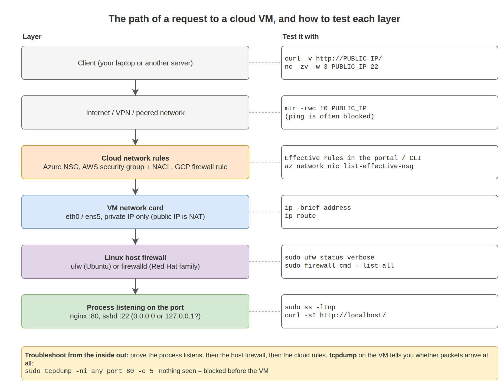

# 13. Networking

Most "the server is down" tickets are network problems: a port not listening, a firewall rule, DNS, or a route. In the cloud there are extra layers outside the VM, such as security groups and route tables. This chapter shows how to test each layer and prove where the problem is.

## What you will learn

- Reading IP addresses, routes, and DNS settings
- Checking which ports are listening and who is connected
- Testing connectivity with `curl`, `nc`, `ping`, and `mtr`
- Host firewalls: `ufw` (Ubuntu) and `firewalld` (Red Hat family)
- How cloud network rules and the Linux firewall work together
- Capturing packets with `tcpdump`

## The path of a request to a cloud VM



A request must pass **every** layer. When something fails, test from the inside out: first prove the process is listening, then the host firewall, then the cloud rules.

## IP addresses and interfaces

```bash
ip -brief address
ip address show eth0
```

Output (example):

```text
lo      UNKNOWN  127.0.0.1/8 ::1/128
eth0    UP       10.0.1.4/24 fe80::20d:3aff:fe12:3456/64
```

Interface names vary: `eth0` on Azure, `ens5` on AWS Nitro instances, `ens4` on Google Cloud.

> A cloud VM normally sees only its **private** IP. The public IP is mapped by the cloud (NAT). To see the public IP from inside: `curl -s https://ifconfig.me`, or the instance metadata service (Chapter 18).

## Routes

```bash
ip route
```

Output (example):

```text
default via 10.0.1.1 dev eth0 proto dhcp src 10.0.1.4 metric 100
10.0.1.0/24 dev eth0 proto kernel scope link src 10.0.1.4 metric 100
168.63.129.16 via 10.0.1.1 dev eth0 proto dhcp src 10.0.1.4 metric 100
169.254.169.254 via 10.0.1.1 dev eth0 proto dhcp src 10.0.1.4 metric 100
```

- `default via 10.0.1.1` is the gateway for everything not listed. In the cloud this is the virtual router of the subnet.
- `168.63.129.16` is the Azure platform address used by the VM agent, DHCP, and DNS. It must stay reachable.
- `169.254.169.254` is the instance metadata service (Azure, AWS, and Google Cloud all use this address).

Which route will a specific destination use?

```bash
ip route get 8.8.8.8
```

## DNS

```bash
resolvectl status                 # Ubuntu (systemd-resolved)
cat /etc/resolv.conf
getent hosts www.microsoft.com    # resolves the way applications do
dig +short www.microsoft.com      # install: dnsutils (Ubuntu) or bind-utils (Red Hat family)
```

Output of `resolvectl status` (example, Azure):

```text
Link 2 (eth0)
    Current Scopes: DNS
Current DNS Server: 168.63.129.16
       DNS Servers: 168.63.129.16
        DNS Domain: abc123.bx.internal.cloudapp.net
```

On Ubuntu, `/etc/resolv.conf` points to `127.0.0.53`, a local stub resolver that forwards to the real servers. That is normal.

| Cloud | Default DNS server seen by the VM |
|---|---|
| Azure | `168.63.129.16` |
| AWS | VPC CIDR base + 2 (for example `10.0.0.2`), also `169.254.169.253` |
| Google Cloud | `169.254.169.254` |

`/etc/hosts` overrides DNS for single names. It is useful for tests and dangerous if forgotten:

```text
10.0.1.20   db01.internal db01
```

## Hostname

```bash
hostnamectl
sudo hostnamectl set-hostname web01
```

On cloud images, cloud-init may reset the hostname at boot. If a change does not stick, set `preserve_hostname: true` in `/etc/cloud/cloud.cfg.d/99-hostname.cfg`.

## Listening ports and connections

```bash
sudo ss -tulpn
```

Output (example):

```text
Netid State  Local Address:Port  Peer Address:Port Process
udp   UNCONN 127.0.0.53%lo:53         0.0.0.0:*     users:(("systemd-resolve",pid=520,fd=13))
tcp   LISTEN 0.0.0.0:22               0.0.0.0:*     users:(("sshd",pid=612,fd=3))
tcp   LISTEN 0.0.0.0:80               0.0.0.0:*     users:(("nginx",pid=1449,fd=6))
tcp   LISTEN 127.0.0.1:8080           0.0.0.0:*     users:(("python3",pid=2240,fd=3))
```

`-t` TCP, `-u` UDP, `-l` listening, `-p` process, `-n` numbers instead of names.

The **Local Address** tells you who can connect:

| Local address | Reachable from |
|---|---|
| `0.0.0.0:80` or `[::]:80` | Any network interface |
| `127.0.0.1:8080` | Only this machine |
| `10.0.1.4:5432` | Only through that interface |

In the example, the Python app on `127.0.0.1:8080` cannot be reached from outside no matter how the firewall is set. This is a very common cause of "port is open in the NSG but it still does not work".

Other useful forms:

```bash
ss -tn state established           # current TCP connections
ss -s                              # summary counts
sudo lsof -i :80                   # which process uses port 80
```

## Testing connectivity

| Tool | Tests | Example |
|---|---|---|
| `curl` | HTTP/HTTPS end to end | `curl -v http://10.0.1.4/` |
| `nc` (netcat) | Can a TCP port be reached | `nc -zv -w 3 10.0.1.20 5432` |
| `ping` | ICMP reachability | `ping -c 4 10.0.1.20` |
| `traceroute` / `mtr` | Path and where it stops | `mtr -rwc 10 8.8.8.8` |
| `openssl s_client` | TLS certificate and handshake | `openssl s_client -connect example.com:443 -servername example.com` |

```bash
curl -sS -o /dev/null -w "%{http_code} %{time_total}s\n" http://localhost/
```

Output:

```text
200 0.002s
```

```bash
nc -zv -w 3 10.0.1.20 5432
```

`-z` only tests the connection, `-v` prints the result, and `-w 3` gives up after 3 seconds. Without `-w`, a blocked port can hang for about two minutes.

Output when open, when blocked, and when nothing listens (examples):

```text
Connection to 10.0.1.20 5432 port [tcp/postgresql] succeeded!
nc: connect to 10.0.1.20 port 5432 (tcp) timed out: Operation now in progress
nc: connect to 10.0.1.20 port 5432 (tcp) failed: Connection refused
```

How to read connection errors:

| Error | Usually means |
|---|---|
| `Connection refused` | Packet arrived, nothing listening on that port (or the host firewall rejected it). |
| `Connection timed out` | Packet dropped on the way: cloud rule, host firewall with drop, or routing. |
| `No route to host` | Routing problem, or a firewall sending that reply. |
| `Could not resolve host` | DNS. |

> ICMP (ping) is often blocked by cloud rules. A failed ping does **not** prove a server is down. Test the real port with `nc` or `curl`.

## Network configuration files

You rarely change these on cloud VMs because the cloud assigns addresses with DHCP. You need to know where they are.

**Ubuntu: netplan**

```bash
ls /etc/netplan/
sudo cat /etc/netplan/50-cloud-init.yaml
```

Output (example):

```yaml
network:
  version: 2
  ethernets:
    eth0:
      dhcp4: true
      match:
        macaddress: "00:0d:3a:12:34:56"
      set-name: eth0
```

Test changes safely. `netplan try` rolls back automatically if you lose the connection:

```bash
sudo netplan try
sudo netplan apply
```

**Red Hat family: NetworkManager**

```bash
nmcli device status
nmcli connection show
```

> Do not set a static IP inside a cloud VM. Assign static private IPs in the cloud network settings and keep DHCP in the VM. A wrong static IP inside the VM cuts off your SSH session.

## Host firewall

The cloud network rules are the main firewall. A host firewall adds a second layer. Many cloud images ship with it disabled. Know which one you have:

```bash
sudo ufw status verbose          # Ubuntu
sudo firewall-cmd --state        # Red Hat family
sudo nft list ruleset | head     # underlying rules on both
```

**ufw (Ubuntu)**

```bash
sudo ufw allow OpenSSH           # allow SSH FIRST, before enabling
sudo ufw allow 80/tcp
sudo ufw allow from 10.0.0.0/16 to any port 5432 proto tcp
sudo ufw enable
sudo ufw status numbered
sudo ufw delete 3
```

**firewalld (Red Hat family)**

```bash
sudo systemctl enable --now firewalld
sudo firewall-cmd --permanent --add-service=ssh
sudo firewall-cmd --permanent --add-service=http
sudo firewall-cmd --permanent --add-rich-rule='rule family="ipv4" source address="10.0.0.0/16" port port="5432" protocol="tcp" accept'
sudo firewall-cmd --reload
sudo firewall-cmd --list-all
```

`--permanent` saves the rule. Without it the rule is lost on reload or reboot. `--reload` applies saved rules.

> **Never enable a host firewall without allowing SSH first.** If you lock yourself out, use the cloud recovery tools: Azure Run Command or Serial Console, AWS Systems Manager or EC2 Serial Console (Chapters 19 and 20).

## Capturing packets with tcpdump

When you need proof that traffic arrives (or does not):

```bash
sudo tcpdump -ni eth0 port 80 -c 10
```

Output (example):

```text
11:45:02.101 IP 203.0.113.50.51544 > 10.0.1.4.80: Flags [S], seq 12345, win 64240
11:45:02.101 IP 10.0.1.4.80 > 203.0.113.50.51544: Flags [S.], seq 67890, ack 12346
```

- You see `[S]` arriving and `[S.]` going back: the network path and the server are fine.
- You see nothing: the packet is blocked **before** the VM (cloud rules or routing).
- You see `[S]` but no reply, or `[R]`: the host firewall or the application is the problem.

Save a capture for Wireshark: `sudo tcpdump -ni eth0 port 443 -w /tmp/https.pcap`.

## Method: "I cannot reach the website"

Run these on the server, in order:

```bash
systemctl is-active nginx                          # 1. Is the service running?
sudo ss -ltnp 'sport = :80'                        # 2. Is it listening, and on which address?
curl -sI http://localhost/ | head -1               # 3. Does it answer locally?
curl -sI http://$(hostname -I | awk '{print $1}')/ | head -1   # 4. On the private IP?
sudo ufw status || sudo firewall-cmd --list-all    # 5. Host firewall?
sudo tcpdump -ni any port 80 -c 5                  # 6. Do packets from the client arrive?
```

If step 6 shows nothing while you test from outside, the problem is in the cloud rules: NSG, security group, network ACL, route table, or the public IP. Check those in Chapters 19 to 21.

## Lab: Prove each layer

1. Start the `myapp` service from Chapter 09. It listens on port 8080.
2. From your laptop, `curl http://<public-ip>:8080`. It fails. Why? (The cloud rule does not allow 8080.)
3. Open 8080 in the cloud rules **for your IP only**. Test again.
4. Enable the host firewall with only SSH allowed. Test again. It fails with a timeout.
5. Allow 8080 in the host firewall. Test again.
6. Change the service to listen on `127.0.0.1` only (edit `app.py`: `TCPServer(("127.0.0.1", PORT), ...)`). Test again. Check `ss -ltnp` to see why it fails.
7. Revert everything and close port 8080 in the cloud rules.

## Common problems

| Symptom | Cause | Fix |
|---|---|---|
| Works on `localhost`, not from outside | Listening on `127.0.0.1`, host firewall, or cloud rule. | `ss -ltnp`, firewall status, cloud rules, in that order. |
| `Temporary failure in name resolution` | DNS broken. | `resolvectl status`, `getent hosts`, check custom DNS on the VNet/VPC. |
| Lost SSH after a network change | Wrong static IP, netplan error, or firewall. | Cloud serial console or run-command. Use `netplan try` next time. |
| Outbound internet fails from a private VM | No NAT gateway, firewall appliance, or proxy. | Check the subnet route table and NAT. `curl -v https://www.microsoft.com`. |
| Azure VM agent not ready | `168.63.129.16` blocked by host firewall or custom DNS. | Allow it. Check `/var/log/waagent.log`. |

## Next

[14. SSH](../14-ssh/README.md)
