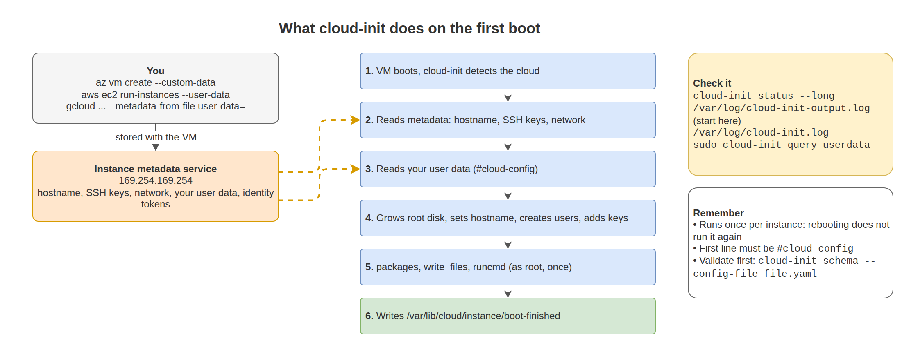

# 18. cloud-init and Instance Metadata

Cloud VMs configure themselves at first boot. **cloud-init** reads instructions you pass when creating the VM (called **user data** or **custom data**) and sets up users, packages, files, and commands. The **instance metadata service** lets software on the VM ask "who am I, where am I, and what credentials do I have?". Together they let you build servers that are ready without anyone logging in.

## What you will learn

- What cloud-init does at boot and where it logs
- Writing a cloud-config file that installs and configures a server
- Passing it on Azure, AWS, and Google Cloud
- Debugging a cloud-init run that did not work
- Querying instance metadata on each cloud
- Getting cloud credentials on the VM without storing secrets

## What happens at first boot



Most modules run only on the **first boot of an instance**. Rebooting does not run your user data again.

| Cloud | Name in the portal/CLI | Size limit |
|---|---|---|
| Azure | Custom data (`--custom-data`) | 64 KB |
| AWS | User data (`--user-data`) | 16 KB |
| Google Cloud | Metadata key `user-data` | 256 KB per value |

Azure also has a separate "user data" feature that cloud-init does not process by default. Use **custom data** for cloud-init on Azure.

## A complete cloud-config example

Save as `cloud-init.yaml`. The first line must be exactly `#cloud-config`.

```yaml
#cloud-config
package_update: true
package_upgrade: true
packages:
  - nginx
  - jq
  - unattended-upgrades

timezone: UTC

users:
  - default
  - name: ops
    groups: [sudo]
    shell: /bin/bash
    sudo: "ALL=(ALL) NOPASSWD:ALL"
    ssh_authorized_keys:
      - ssh-ed25519 AAAAC3NzaC1lZDI1NTE5AAAA... ops@laptop

write_files:
  - path: /var/www/html/index.html
    permissions: "0644"
    content: |
      <h1>Built by cloud-init</h1>
  - path: /etc/ssh/sshd_config.d/10-hardening.conf
    permissions: "0644"
    content: |
      PermitRootLogin no
      PasswordAuthentication no

runcmd:
  - systemctl enable --now nginx
  - systemctl reload ssh
  - echo "bootstrap finished at $(date -Is)" >> /var/log/bootstrap.log

final_message: "cloud-init finished after $UPTIME seconds"
```

| Key | What it does |
|---|---|
| `package_update` / `package_upgrade` | `apt update` / `apt upgrade` (or dnf) |
| `packages` | Install packages |
| `users` | `default` keeps the image's normal user. Add more users with keys and groups. |
| `write_files` | Create files with content and permissions |
| `runcmd` | Shell commands, run once, late in the first boot, as root |
| `bootcmd` | Commands that run on **every** boot, very early |

On Red Hat family images, use group `wheel` instead of `sudo` and `systemctl reload sshd`.

Validate the file before you use it (on any machine with cloud-init installed):

```bash
cloud-init schema --config-file cloud-init.yaml
```

Output:

```text
Valid schema cloud-init.yaml
```

A plain shell script also works as user data. It must start with `#!/bin/bash`. Scripts run once, as root, like `runcmd`.

## Pass it to the cloud

**Azure**

```bash
az vm create -g lab-rg -n web01 \
  --image Canonical:ubuntu-24_04-lts:server:latest \
  --admin-username azureuser --ssh-key-values ~/.ssh/id_ed25519.pub \
  --custom-data cloud-init.yaml
```

**AWS**

```bash
aws ec2 run-instances \
  --image-id resolve:ssm:/aws/service/canonical/ubuntu/server/24.04/stable/current/amd64/hvm/ebs-gp3/ami-id \
  --instance-type t3.micro --key-name lab-key \
  --security-group-ids sg-0123456789abcdef0 \
  --user-data file://cloud-init.yaml
```

**Google Cloud**

```bash
gcloud compute instances create web01 --zone us-central1-a \
  --image-family ubuntu-2404-lts-amd64 --image-project ubuntu-os-cloud \
  --metadata-from-file user-data=cloud-init.yaml
```

The full create steps for each cloud are in Chapters 19, 20, and 21.

## Did it work? Debugging cloud-init

```bash
cloud-init status --long
```

Output (example, success):

```text
status: done
extended_status: done
boot_status_code: enabled-by-generator
last_update: Tue, 23 Sep 2026 12:50:11 +0000
detail: DataSourceAzure [seed=/dev/sr0]
errors: []
```

Output (example, failure):

```text
status: error
errors:
	- ('scripts_user', RuntimeError('Runparts: 1 failures (runcmd) in /var/lib/cloud/instance/scripts'))
```

Where to look:

| File or command | Contains |
|---|---|
| `/var/log/cloud-init-output.log` | Output of your packages, scripts, and `runcmd`. **Start here.** |
| `/var/log/cloud-init.log` | Detailed log of every module |
| `sudo cloud-init query userdata` | The user data the VM actually received |
| `/var/lib/cloud/instance/scripts/runcmd` | Your `runcmd` turned into a script |
| `cloud-init analyze show` | Time spent in each stage |

```bash
sudo tail -n 40 /var/log/cloud-init-output.log
sudo grep -iE 'error|warn|fail' /var/log/cloud-init.log | tail
```

Common causes: YAML indentation, missing `#cloud-config` header, a package name that does not exist on that distribution, a command that needs the network before it is up, and user data base64-encoded twice.

Run cloud-init again on a lab VM (this re-runs first-boot modules, do not do this on production):

```bash
sudo cloud-init clean --logs
sudo reboot
```

Wait for it to finish in scripts:

```bash
cloud-init status --wait
```

## Instance metadata service

Every major cloud serves metadata at the link-local address `169.254.169.254`. It is reachable only from inside the VM.

**Azure (IMDS)** needs the header `Metadata: true`:

```bash
curl -s -H "Metadata: true" --noproxy "*" \
  "http://169.254.169.254/metadata/instance?api-version=2021-02-01" | jq '.compute | {name, location, vmSize, resourceGroupName}'
```

Output (example):

```json
{
  "name": "web01",
  "location": "eastus",
  "vmSize": "Standard_B2s",
  "resourceGroupName": "lab-rg"
}
```

Public IP:

```bash
curl -s -H "Metadata: true" --noproxy "*" \
  "http://169.254.169.254/metadata/instance/network/interface/0/ipv4/ipAddress/0/publicIpAddress?api-version=2021-02-01&format=text"
```

**AWS (IMDSv2)** needs a session token first:

```bash
TOKEN=$(curl -sX PUT "http://169.254.169.254/latest/api/token" \
  -H "X-aws-ec2-metadata-token-ttl-seconds: 21600")
curl -s -H "X-aws-ec2-metadata-token: $TOKEN" http://169.254.169.254/latest/meta-data/instance-id
curl -s -H "X-aws-ec2-metadata-token: $TOKEN" http://169.254.169.254/latest/meta-data/placement/availability-zone
```

Output (example):

```text
i-0abc123def4567890
us-east-1a
```

New instances usually require IMDSv2. Requests without a token then return `401 Unauthorized`.

**Google Cloud** needs the header `Metadata-Flavor: Google`:

```bash
curl -s -H "Metadata-Flavor: Google" \
  "http://metadata.google.internal/computeMetadata/v1/instance/zone"
```

Output (example):

```text
projects/123456789012/zones/us-central1-a
```

## Cloud credentials without secrets

Give the VM an identity in the cloud, grant that identity permissions, and let tools on the VM fetch short-lived tokens from the metadata service. Nothing secret is stored on disk.

| Cloud | Identity for a VM | Use from the VM |
|---|---|---|
| Azure | Managed identity | `az login --identity`, then `az ...` |
| AWS | IAM role via instance profile | AWS CLI and SDKs pick it up automatically |
| Google Cloud | Service account attached to the VM | `gcloud` and SDKs pick it up automatically |

Azure example: a VM with a system-assigned managed identity that has "Storage Blob Data Reader" on a storage account:

```bash
az login --identity
az storage blob list --account-name mystorageacct --container-name backups --auth-mode login -o table
```

AWS example: check which role the instance has:

```bash
aws sts get-caller-identity
```

Output (example):

```json
{
    "UserId": "AROAXXXXXXXXXXXXXXXXX:i-0abc123def4567890",
    "Account": "123456789012",
    "Arn": "arn:aws:sts::123456789012:assumed-role/web-server-role/i-0abc123def4567890"
}
```

> Because the metadata service hands out credentials, any process on the VM that can make an HTTP request can get them. Keep the identity's permissions minimal, and keep IMDSv2 required on AWS.

## Lab: Zero-touch web server

1. Write a cloud-config that installs nginx, writes a custom `index.html` containing the hostname (use `runcmd` with `hostname > /var/www/html/index.html`), creates an `ops` user with your key, and hardens SSH.
2. Validate it with `cloud-init schema`.
3. Create a VM with it on your cloud of choice. Do not log in yet.
4. From your laptop, `curl http://<public-ip>` until it answers.
5. Log in as `ops`, run `cloud-init status --long`, and read `/var/log/cloud-init-output.log`.
6. Break the YAML on purpose (wrong indentation), create a second VM, and find the error.
7. Query the metadata service for the VM name and region.
8. Delete both VMs.

## Common problems

| Symptom | Cause | Fix |
|---|---|---|
| Nothing from user data happened | Missing `#cloud-config` first line, or YAML error. | `cloud-init schema`, `cloud-init query userdata`. |
| `status: error` | A module or `runcmd` command failed. | `/var/log/cloud-init-output.log`. |
| Changes to user data have no effect | cloud-init runs once per instance. | Recreate the VM, or `cloud-init clean` on a lab VM. |
| Package install failed at boot | Network or repo not ready, name wrong for that distro. | Check the output log. Retry in `runcmd`. |
| Metadata `401` on AWS | IMDSv2 requires a token. | Use the token request shown above. |
| Metadata hangs on Azure | A proxy intercepts the request. | Add `--noproxy "*"`. |

## Next

[19. Linux on Azure](../19-linux-on-azure/README.md)
