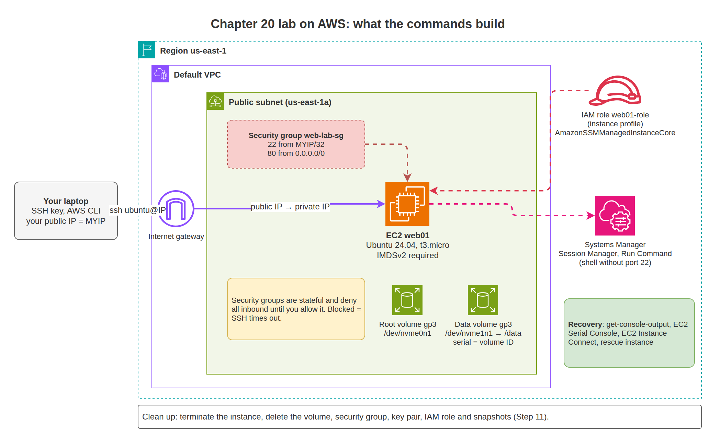

# 20. Linux on AWS

This chapter takes a Linux instance on Amazon EC2 through its whole life: launch it securely, connect, add and grow EBS volumes, change the instance type, recover when you are locked out or it will not boot, and clean up. Commands use the AWS CLI v2. The console location is given where it helps.

## What you will learn

- Launching an EC2 instance with SSH restricted to your IP and IMDSv2 required
- Connecting with SSH, EC2 Instance Connect, and Systems Manager Session Manager
- Attaching, mounting, and expanding EBS volumes on Nitro (NVMe) instances
- Changing instance type, and stop vs terminate
- IAM roles for instances
- Recovery tools: console output, EC2 Serial Console, Systems Manager, rescue instance
- Cleaning up every resource you created

## Before you start

- AWS CLI v2 configured: `aws configure` (access keys) or `aws configure sso`.
- An SSH key pair (Chapter 14).
- This chapter uses the **default VPC** in your region, which has public subnets. Production workloads usually run in private subnets.

```bash
aws sts get-caller-identity
export AWS_REGION=us-east-1
MYIP=$(curl -s https://ifconfig.me)
```

## Step 1: Import your SSH key

Using your own key means the private key never leaves your laptop:

```bash
aws ec2 import-key-pair --key-name my-laptop \
  --public-key-material fileb://~/.ssh/id_ed25519.pub
```

Alternatively, let AWS create one and download the private key once:

```bash
aws ec2 create-key-pair --key-name lab-key --key-type ed25519 \
  --query KeyMaterial --output text > ~/.ssh/lab-key.pem
chmod 400 ~/.ssh/lab-key.pem
```

## Step 2: Create a security group

A security group is a **stateful** firewall attached to the instance's network interface. Everything inbound is denied until you allow it.

```bash
VPC_ID=$(aws ec2 describe-vpcs --filters Name=is-default,Values=true --query "Vpcs[0].VpcId" --output text)

SG_ID=$(aws ec2 create-security-group --group-name web-lab-sg \
  --description "Lab web server" --vpc-id "$VPC_ID" --query GroupId --output text)

aws ec2 authorize-security-group-ingress --group-id "$SG_ID" \
  --protocol tcp --port 22 --cidr "$MYIP/32"

aws ec2 authorize-security-group-ingress --group-id "$SG_ID" \
  --protocol tcp --port 80 --cidr 0.0.0.0/0
```

## Step 3: Launch the instance

```bash
INSTANCE_ID=$(aws ec2 run-instances \
  --image-id resolve:ssm:/aws/service/canonical/ubuntu/server/24.04/stable/current/amd64/hvm/ebs-gp3/ami-id \
  --instance-type t3.micro \
  --key-name my-laptop \
  --security-group-ids "$SG_ID" \
  --metadata-options "HttpTokens=required,HttpEndpoint=enabled" \
  --block-device-mappings '[{"DeviceName":"/dev/sda1","Ebs":{"VolumeSize":20,"VolumeType":"gp3","Encrypted":true}}]' \
  --tag-specifications 'ResourceType=instance,Tags=[{Key=Name,Value=web01}]' \
  --query "Instances[0].InstanceId" --output text)

aws ec2 wait instance-running --instance-ids "$INSTANCE_ID"
IP=$(aws ec2 describe-instances --instance-ids "$INSTANCE_ID" \
  --query "Reservations[0].Instances[0].PublicIpAddress" --output text)
echo "$INSTANCE_ID $IP"
```

- `resolve:ssm:...` always picks the latest official Ubuntu 24.04 AMI for the region. For Amazon Linux 2023 use `resolve:ssm:/aws/service/ami-amazon-linux-latest/al2023-ami-kernel-default-x86_64`.
- `HttpTokens=required` forces IMDSv2 (Chapter 18).
- The root device name for Ubuntu AMIs is `/dev/sda1`. Amazon Linux uses `/dev/xvda`. Check with `aws ec2 describe-images --image-ids <ami> --query "Images[0].RootDeviceName"`.
- Add `--user-data file://cloud-init.yaml` to configure the instance at first boot.

**Console:** EC2 > Instances > Launch instances.

The finished lab after Steps 1 to 7 looks like this:



## Step 4: Connect

```bash
ssh -i ~/.ssh/id_ed25519 ubuntu@"$IP"
```

The username depends on the AMI: `ubuntu` (Ubuntu), `ec2-user` (Amazon Linux, RHEL), `admin` (Debian), `rocky` (Rocky Linux).

AWS-specific checks on the instance:

```bash
lsblk -o NAME,SIZE,SERIAL,MOUNTPOINTS
cloud-init status --long
snap services amazon-ssm-agent 2>/dev/null || systemctl status amazon-ssm-agent --no-pager
```

On Ubuntu the SSM agent is installed as a snap. On Amazon Linux it is a normal service.

## Step 5: Give the instance an IAM role

An instance profile lets software on the instance call AWS APIs with temporary credentials, and it is required for Systems Manager.

```bash
cat > trust.json <<'EOF'
{
  "Version": "2012-10-17",
  "Statement": [{
    "Effect": "Allow",
    "Principal": {"Service": "ec2.amazonaws.com"},
    "Action": "sts:AssumeRole"
  }]
}
EOF

aws iam create-role --role-name web01-role --assume-role-policy-document file://trust.json
aws iam attach-role-policy --role-name web01-role \
  --policy-arn arn:aws:iam::aws:policy/AmazonSSMManagedInstanceCore
aws iam create-instance-profile --instance-profile-name web01-profile
aws iam add-role-to-instance-profile --instance-profile-name web01-profile --role-name web01-role
sleep 10
aws ec2 associate-iam-instance-profile --instance-id "$INSTANCE_ID" \
  --iam-instance-profile Name=web01-profile
```

`AmazonSSMManagedInstanceCore` is the minimum policy for Session Manager and Run Command. Add only the other permissions the application needs.

## Step 6: Connect without SSH: Session Manager

After a few minutes, the instance registers with Systems Manager:

```bash
aws ssm describe-instance-information \
  --query "InstanceInformationList[].{Id:InstanceId,Ping:PingStatus,OS:PlatformName}" --output table
```

Output (example):

```text
-------------------------------------------------
|          DescribeInstanceInformation          |
+----------------------+---------+--------------+
|          Id          |   OS    |    Ping      |
+----------------------+---------+--------------+
|  i-0abc123def4567890 |  Ubuntu |  Online      |
+----------------------+---------+--------------+
```

Open a shell (requires the Session Manager plugin for the AWS CLI on your laptop):

```bash
aws ssm start-session --target "$INSTANCE_ID"
```

No inbound port 22, no key, and every session can be logged. Many teams remove SSH from the security group completely once Session Manager works.

Run a command on the instance without a shell:

```bash
CMD_ID=$(aws ssm send-command --instance-ids "$INSTANCE_ID" \
  --document-name AWS-RunShellScript \
  --parameters 'commands=["systemctl is-active ssh","df -h /"]' \
  --query Command.CommandId --output text)
sleep 3
aws ssm get-command-invocation --command-id "$CMD_ID" --instance-id "$INSTANCE_ID" \
  --query StandardOutputContent --output text
```

## Step 7: Add an EBS volume

A volume must be in the **same Availability Zone** as the instance.

```bash
AZ=$(aws ec2 describe-instances --instance-ids "$INSTANCE_ID" \
  --query "Reservations[0].Instances[0].Placement.AvailabilityZone" --output text)

VOL_ID=$(aws ec2 create-volume --availability-zone "$AZ" --size 20 --volume-type gp3 --encrypted \
  --tag-specifications 'ResourceType=volume,Tags=[{Key=Name,Value=web01-data}]' \
  --query VolumeId --output text)
aws ec2 wait volume-available --volume-ids "$VOL_ID"

aws ec2 attach-volume --volume-id "$VOL_ID" --instance-id "$INSTANCE_ID" --device /dev/sdf
```

On the instance, the volume does **not** appear as `/dev/sdf`. Nitro instances expose EBS as NVMe devices:

```bash
lsblk -o NAME,SIZE,SERIAL,MOUNTPOINTS
```

Output (example):

```text
NAME         SIZE SERIAL               MOUNTPOINTS
nvme0n1       20G vol0a1b2c3d4e5f60718
├─nvme0n1p1   19G                      /
└─nvme0n1p15 106M                      /boot/efi
nvme1n1       20G vol0f9e8d7c6b5a49382
```

The serial `vol0f9e8d7c6b5a49382` is `$VOL_ID` without the dash. Partition, format, mount, and add to fstab as in [Chapter 12](../12-storage-and-filesystems/README.md#add-a-data-disk-step-by-step), using `/dev/nvme1n1`.

> Instance types with **instance store** volumes (for example `m6id`) show extra NVMe disks. Instance store data is lost when the instance stops. Use it only for temporary data.

## Step 8: Expand an EBS volume

EBS volumes grow while attached and in use:

```bash
aws ec2 modify-volume --volume-id "$VOL_ID" --size 40
aws ec2 describe-volumes-modifications --volume-ids "$VOL_ID" \
  --query "VolumesModifications[0].{State:ModificationState,Progress:Progress}" --output table
```

When the state is `optimizing` or `completed`, grow the partition and filesystem on the instance:

```bash
sudo growpart /dev/nvme1n1 1
sudo resize2fs /dev/nvme1n1p1        # ext4
# sudo xfs_growfs /data              # xfs
df -h /data
```

The root volume works the same way (`growpart /dev/nvme0n1 1`, then `resize2fs /dev/nvme0n1p1` or `xfs_growfs /`).

AWS limits how often the same volume can be modified, so plan the final size instead of growing in small steps. Check the current limit in the EBS "Elastic Volumes" documentation. Volumes cannot shrink.

## Step 9: Change instance type, stop, and terminate

```bash
aws ec2 stop-instances --instance-ids "$INSTANCE_ID"
aws ec2 wait instance-stopped --instance-ids "$INSTANCE_ID"
aws ec2 modify-instance-attribute --instance-id "$INSTANCE_ID" --instance-type '{"Value":"t3.small"}'
aws ec2 start-instances --instance-ids "$INSTANCE_ID"
```

| State | Compute billed? | EBS billed? | Public IP |
|---|---|---|---|
| Running | Yes | Yes | Kept |
| Stopped | No | Yes | **Released** unless it is an Elastic IP |
| Terminated | No | Root volume deleted by default. Other volumes stay unless "delete on termination" is set. | Released |

After a stop and start, your public IP changes. Update `~/.ssh/config`, or use an Elastic IP for servers that need a fixed address.

Protect important instances from accidental termination:

```bash
aws ec2 modify-instance-attribute --instance-id "$INSTANCE_ID" --disable-api-termination
```

## Step 10: Snapshots

```bash
aws ec2 create-snapshot --volume-id "$VOL_ID" --description "web01 data $(date +%F)" \
  --tag-specifications 'ResourceType=snapshot,Tags=[{Key=Name,Value=web01-data}]'
```

Restore by creating a new volume from the snapshot (`aws ec2 create-volume --snapshot-id ...`) and attaching it. For schedules and retention, use **AWS Backup** or **Data Lifecycle Manager**.

## Recovery tools

### 1. Console output and screenshot

```bash
aws ec2 get-console-output --instance-id "$INSTANCE_ID" --latest --output text | tail -40
aws ec2 get-console-screenshot --instance-id "$INSTANCE_ID" --query ImageData --output text | base64 -d > screen.jpg
```

Shows boot messages, including fstab failures and kernel panics.

### 2. Systems Manager

If the SSM agent is online, use Session Manager or Run Command (Step 6) to fix SSH, firewall, or permission problems without port 22.

### 3. EC2 Instance Connect

Pushes a temporary public key (valid 60 seconds) for one login. Useful when you lost the private key. Ubuntu and Amazon Linux AMIs include the required package:

```bash
aws ec2-instance-connect send-ssh-public-key --instance-id "$INSTANCE_ID" \
  --instance-os-user ubuntu --ssh-public-key file://~/.ssh/id_ed25519.pub
ssh -i ~/.ssh/id_ed25519 ubuntu@"$IP"
```

It still needs port 22 open from your IP (or an EC2 Instance Connect Endpoint for private subnets).

### 4. EC2 Serial Console

An interactive console that works even when networking is broken. Requirements: Nitro instance, serial console access enabled for the account, and a Linux user with a **password** for the login prompt.

```bash
aws ec2 enable-serial-console-access
aws ec2-instance-connect send-serial-console-ssh-public-key \
  --instance-id "$INSTANCE_ID" --serial-port 0 --ssh-public-key file://~/.ssh/id_ed25519.pub
ssh -i ~/.ssh/id_ed25519 "$INSTANCE_ID.port0@serial-console.ec2-instance-connect.$AWS_REGION.aws"
```

Or in the console: EC2 > Instance > Connect > EC2 serial console. Set a password for a user in advance on important servers (`sudo passwd ubuntu`), because you cannot set one after the instance stops booting.

### 5. Rescue instance: fix the root volume offline

When nothing else works:

1. Stop the broken instance.
2. Detach its root volume.
3. Attach it to a working instance in the same Availability Zone as `/dev/sdf`.
4. On the rescue instance, mount it and fix the files:

```bash
lsblk
sudo mkdir -p /rescue
sudo mount /dev/nvme1n1p1 /rescue          # partition number may differ
sudo nano /rescue/etc/fstab                # for example, fix a bad fstab line
sudo umount /rescue
```

5. Detach it and reattach it to the original instance with its original root device name (`/dev/sda1` for Ubuntu, `/dev/xvda` for Amazon Linux).
6. Start the original instance.

> If both volumes come from the same AMI, their filesystems have the same UUID. XFS refuses to mount a duplicate UUID: use `sudo mount -o nouuid /dev/nvme1n1p1 /rescue`.

AWS also provides the `AWSSupport-ExecuteEC2Rescue` Systems Manager automation, which performs these steps for common problems.

## Monitoring

- **CloudWatch metrics** (CPU, network, disk operations, status checks) are available without an agent. Memory and disk **space** need the **CloudWatch agent**.
- **Status checks:** "System" failures are AWS host problems (stop and start moves the instance to new hardware). "Instance" failures are inside your OS (boot, network config, kernel).
- Patching at scale: **Systems Manager Patch Manager**.

```bash
aws ec2 describe-instance-status --instance-ids "$INSTANCE_ID" \
  --query "InstanceStatuses[0].{System:SystemStatus.Status,Instance:InstanceStatus.Status}" --output table
```

## Step 11: Clean up

```bash
aws ec2 terminate-instances --instance-ids "$INSTANCE_ID"
aws ec2 wait instance-terminated --instance-ids "$INSTANCE_ID"
aws ec2 delete-volume --volume-id "$VOL_ID"
aws ec2 delete-security-group --group-id "$SG_ID"
aws ec2 delete-key-pair --key-name my-laptop
aws iam remove-role-from-instance-profile --instance-profile-name web01-profile --role-name web01-role
aws iam delete-instance-profile --instance-profile-name web01-profile
aws iam detach-role-policy --role-name web01-role --policy-arn arn:aws:iam::aws:policy/AmazonSSMManagedInstanceCore
aws iam delete-role --role-name web01-role
```

Also delete any snapshots and Elastic IPs you created. They are billed until deleted:

```bash
aws ec2 describe-snapshots --owner-ids self --query "Snapshots[].{Id:SnapshotId,Desc:Description}" --output table
aws ec2 describe-addresses --query "Addresses[].{IP:PublicIp,Alloc:AllocationId}" --output table
```

## Lab: Full AWS lifecycle

1. Launch `web01` with the cloud-config from Chapter 18, IMDSv2 required, SSH from your IP only.
2. Attach an IAM role with `AmazonSSMManagedInstanceCore` and confirm Session Manager works.
3. Attach a 20 GB gp3 volume, find it by serial number, mount it at `/data` with fstab, reboot, confirm.
4. Grow it to 40 GB online and extend the filesystem.
5. Remove port 22 from the security group. Keep working through Session Manager.
6. Add a bad fstab line without `nofail` and reboot. Read the failure with `get-console-output`.
7. Fix it using the EC2 Serial Console or a rescue instance.
8. Snapshot the data volume.
9. Clean up everything, including the IAM role and snapshots.

## Common problems

| Symptom | Cause | Fix |
|---|---|---|
| SSH times out | Security group, network ACL, no public IP, or subnet without internet gateway route. | Check SG inbound from your current IP, subnet route table has `0.0.0.0/0 -> igw-...`. |
| `Permission denied (publickey)` | Wrong username for the AMI, or wrong key. | Check the AMI's default user. EC2 Instance Connect to push a key. |
| Instance not in Systems Manager | No instance profile, agent stopped, or no route to SSM endpoints. | Attach the role, wait a few minutes, check outbound HTTPS or VPC endpoints. |
| Volume `/dev/sdf` not found | Nitro instances use NVMe names. | `lsblk -o NAME,SERIAL`. |
| Public IP changed | Stop/start releases non-Elastic IPs. | Elastic IP, or use DNS. |
| `InsufficientInstanceCapacity` | No capacity for that type in that AZ right now. | Try another AZ or type, or retry later. |
| Status check "Instance" failed | OS-level problem (boot, fstab, network config). | Console output, serial console, rescue instance. |

## Next

[21. Linux on Google Cloud](../21-linux-on-gcp/README.md)
