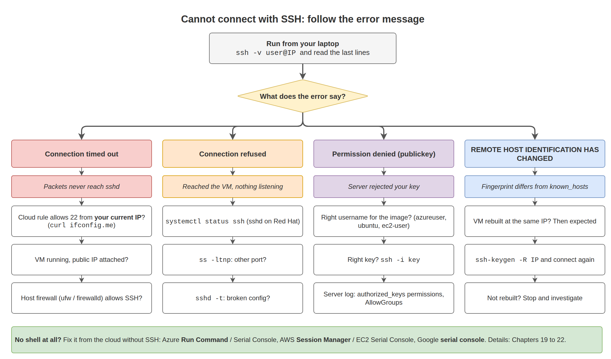
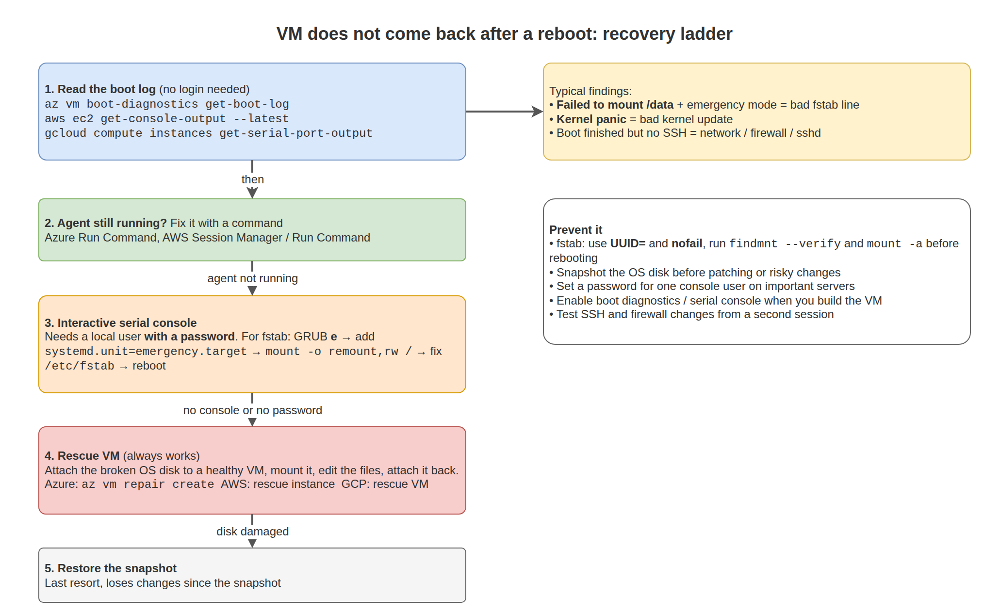

# 22. Troubleshooting

This chapter is a playbook. Each scenario lists what you see, the commands that find the cause, the fix, and how to stop it happening again. Read the method first. It works for problems that are not listed here.

## The method

1. **Define the problem exactly.** "Website is down" becomes "`curl` from my laptop to port 80 times out since 10:15".
2. **Check what changed.** Deployments, updates (`/var/log/apt/history.log`, `dnf history`), config edits, cloud changes (Azure Activity Log, AWS CloudTrail, GCP Audit Logs).
3. **Test layer by layer, inside out.** Process running? Listening? Answers locally? Host firewall? Cloud network? DNS?
4. **Read the logs** before you restart anything. A restart can clear the evidence.
5. **Change one thing at a time**, and note what you changed.
6. **Confirm the fix** with the same test that showed the failure.
7. **Write it down**: cause, fix, prevention.

## Quick index

| Symptom | Section |
|---|---|
| SSH times out, is refused, or says permission denied | [Cannot connect with SSH](#cannot-connect-with-ssh) |
| VM stuck at boot after editing `/etc/fstab` | [Server does not boot after an fstab change](#server-does-not-boot-after-an-fstab-change) |
| VM does not boot after a kernel update | [Server does not boot after a kernel update](#server-does-not-boot-after-a-kernel-update) |
| `No space left on device` | [Disk full](#disk-full) |
| Server slow, high load | [High CPU or load](#high-cpu-or-load) |
| Processes killed, memory exhausted | [Out of memory](#out-of-memory) |
| `systemctl start` fails | [Service does not start](#service-does-not-start) |
| nginx returns 502, 503, or 403 | [Web server errors](#web-server-errors) |
| Names do not resolve | [DNS does not work](#dns-does-not-work) |
| `apt` or `dnf` fails | [Package manager errors](#package-manager-errors) |
| `Read-only file system` | [Filesystem became read-only](#filesystem-became-read-only) |
| `sudo` broken | [sudo does not work](#sudo-does-not-work) |
| TLS or login errors about time | [Clock is wrong](#clock-is-wrong) |
| `Too many open files` | [Too many open files](#too-many-open-files) |

---

## Cannot connect with SSH



**Symptoms:** `Connection timed out`, `Connection refused`, or `Permission denied (publickey)`.

**Diagnose from your laptop:**

```bash
ssh -v user@IP                  # read the last lines before the failure
nc -zv -w 3 IP 22               # is the port reachable at all?
curl -s https://ifconfig.me     # has your own public IP changed?
```

| Result | Look at |
|---|---|
| Timeout | Cloud rule (NSG / security group / firewall rule) for port 22 from **your current** IP, public IP exists, VM running, host firewall |
| Refused | SSH service stopped or listening on another port |
| Permission denied (publickey) | Username for the image, key file, `authorized_keys` content and permissions, `AllowGroups`/`AllowUsers` |

**Diagnose from the cloud, without SSH:**

```bash
# Azure
az vm get-instance-view -g RG -n VM --query "instanceView.statuses[].displayStatus" -o tsv
az vm run-command invoke -g RG -n VM --command-id RunShellScript \
  --scripts "systemctl status ssh --no-pager; ss -ltnp | grep ':22'; ufw status; tail -n 20 /var/log/auth.log"

# AWS (needs Systems Manager, Chapter 20)
aws ssm send-command --instance-ids ID --document-name AWS-RunShellScript \
  --parameters 'commands=["systemctl status ssh --no-pager","ss -ltnp","tail -n 20 /var/log/auth.log"]'

# Google Cloud
gcloud compute instances get-serial-port-output VM | tail -40
```

**Common fixes (run through Run Command, Session Manager, or a serial console):**

```bash
# SSH service stopped
systemctl enable --now ssh              # sshd on Red Hat family

# Host firewall blocks SSH
ufw allow OpenSSH                       # or: firewall-cmd --permanent --add-service=ssh && firewall-cmd --reload

# Key permissions
chown -R azureuser:azureuser /home/azureuser/.ssh
chmod 700 /home/azureuser/.ssh && chmod 600 /home/azureuser/.ssh/authorized_keys

# Broken sshd_config
sshd -t                                 # shows the bad line
```

Cloud tools that add keys or reset SSH: `az vm user update` / `az vm user reset-ssh` (Azure), EC2 Instance Connect (AWS), `gcloud compute ssh` (Google Cloud).

**Prevent:** keep a recovery path ready before you need it: Run Command / Systems Manager working, a password set for a console user on important servers, and test SSH changes from a second session.

---

## Server does not boot after an fstab change



**Symptoms:** VM starts but SSH never answers. Boot log shows:

```text
[FAILED] Failed to mount /data.
[DEPEND] Dependency failed for Local File Systems.
You are in emergency mode. After logging in, type "journalctl -xb" to view system logs...
Give root password for maintenance
(or press Control-D to continue):
```

**Diagnose:** read the boot log without logging in:

```bash
az vm boot-diagnostics get-boot-log -g RG -n VM | tail -40        # Azure
aws ec2 get-console-output --instance-id ID --latest --output text  # AWS
gcloud compute instances get-serial-port-output VM | tail -40      # Google Cloud
```

**Fix option 1: serial console** (Azure Serial Console, EC2 Serial Console, GCP serial port).

Cloud images usually lock the root account, so the emergency shell may not accept a login. Reboot and edit the kernel line in GRUB instead:

1. From the serial console, restart the VM and press `Esc` (or hold `Shift`) as it starts, to open the GRUB menu.
2. Press `e` on the first entry.
3. Find the line that starts with `linux` and add `systemd.unit=emergency.target` (or, if that still asks for a root password, `init=/bin/bash`) at the end.
4. Press `Ctrl+X` to boot.
5. The root filesystem may be read-only. Remount it, fix fstab, and reboot:

```bash
mount -o remount,rw /
nano /etc/fstab                  # comment out the bad line with #, or add nofail
sync
reboot -f
```

If you used `init=/bin/bash`, systemd is not running, so use `reboot -f` or `echo b > /proc/sysrq-trigger`.

**Fix option 2: rescue VM.** Attach the OS disk to another VM, mount it, edit `etc/fstab` on it, and reattach (Azure `az vm repair`, AWS rescue instance in Chapter 20).

**Prevent:** use `UUID=` and `nofail` for every non-root disk, and always run `sudo findmnt --verify` and `sudo mount -a` before rebooting.

---

## Server does not boot after a kernel update

**Symptoms:** boot log shows a kernel panic, or stops after loading the kernel.

**Fix:** from the serial console, open the GRUB menu (as above), choose **Advanced options**, and boot the previous kernel. Once booted:

```bash
uname -r                                   # confirm you are on the old kernel
dpkg --list 'linux-image*' | grep ^ii      # Ubuntu: installed kernels
sudo apt remove linux-image-<bad-version>  # remove the broken one
# Red Hat family:
sudo grubby --info=ALL | grep -E '^(index|kernel)'
sudo grubby --set-default /boot/vmlinuz-<good-version>
```

**Prevent:** patch a test VM first, keep at least one previous kernel installed, take a snapshot before patching critical servers.

---

## Disk full

**Symptoms:** `No space left on device`, services crash, `apt` fails, logins slow.

**Diagnose:**

```bash
df -hT                                          # which filesystem
df -i                                           # or out of inodes?
sudo du -xh --max-depth=1 / 2>/dev/null | sort -h | tail -15
sudo du -xh --max-depth=1 /var 2>/dev/null | sort -h | tail -10
sudo find / -xdev -type f -size +200M -exec ls -lh {} + 2>/dev/null | sort -k5 -h | tail
```

**Usual suspects and fixes:**

| Location | Fix |
|---|---|
| `/var/log` (application logs) | Compress or delete old logs, add a logrotate rule (Chapter 11) |
| Journal | `sudo journalctl --vacuum-size=200M` |
| `/var/cache/apt` or `/var/cache/dnf` | `sudo apt clean` / `sudo dnf clean all` |
| Old kernels in `/boot` | `sudo apt autoremove --purge` |
| Docker | `docker system df`, then `docker system prune` (removes unused data, read the prompt) |
| Core dumps | `/var/crash`, `/var/lib/systemd/coredump` |

**Deleted but space not freed:**

```bash
sudo lsof +L1 | head
```

A process still holds the deleted file open. Restart that service, or truncate through `/proc`:

```bash
sudo truncate -s 0 /proc/<pid>/fd/<fd-number>
```

**Long-term fix:** grow the disk (Chapters 12 and 19 to 21) or move data to a data disk.

**Prevent:** logrotate for every application log, journal size limit, disk space alerts from the cloud monitoring agent.

---

## High CPU or load

**Diagnose:**

```bash
uptime
vmstat 1 5
ps -eo pid,user,%cpu,%mem,etime,cmd --sort=-%cpu | head
```

| What you see | Meaning | Action |
|---|---|---|
| One process near 100% per core | Application busy or stuck in a loop | Check its logs. Restart through systemd if it is stuck. Fix the cause. |
| High `wa` in `vmstat`, load high but CPU idle | Waiting on disk | Go to disk I/O in Chapter 17 (`iostat -xz`, `pidstat -d`) |
| High `st` | Hypervisor limiting the VM (burstable credits) | Check CPU credits in cloud metrics, resize |
| Many short-lived processes | Cron job or script storm | `sudo journalctl --since "10 min ago"`, check timers and crontabs |
| Unknown process names, high CPU, outbound connections | Possible compromise (for example crypto mining) | Isolate the VM (cloud firewall), take a snapshot for investigation, involve security |

---

## Out of memory

**Symptoms:** processes disappear, `Killed` in the terminal, service status shows `oom-kill`.

**Diagnose:**

```bash
free -h
sudo dmesg -T | grep -iE 'out of memory|killed process'
ps -eo pid,user,rss,cmd --sort=-rss | head
systemctl status <service> --no-pager | grep -i oom
```

**Fix:** restart the service, then find why memory grew: too many workers, a leak, or a cache without a limit. Add a swap file as a short-term buffer (Chapter 12). Limit the service with `MemoryMax=` so it cannot take down the server. Resize the VM if the workload legitimately needs more.

---

## Service does not start

**Diagnose:**

```bash
systemctl status myapp --no-pager
journalctl -u myapp -b --no-pager | tail -40
systemctl cat myapp
```

| Message | Cause | Fix |
|---|---|---|
| `status=203/EXEC` | `ExecStart` path wrong or not executable | Full path, `chmod +x` |
| `status=217/USER` | `User=` does not exist | `useradd --system ...` |
| `Address already in use` | Port taken | `sudo ss -ltnp 'sport = :PORT'` |
| `Permission denied` on a file | Service user cannot read it | `namei -l /path`, fix ownership (Chapter 07) |
| `Start request repeated too quickly` | Crash loop hit the restart limit | Fix the crash, then `systemctl reset-failed myapp` |
| Config syntax error | Bad edit | Run the service's test command (`nginx -t`, `sshd -t`) |

On Red Hat family systems, also check SELinux: `sudo ausearch -m avc -ts recent`.

---

## Web server errors

```bash
curl -sI http://localhost/ | head -1
sudo tail -n 30 /var/log/nginx/error.log
```

| Code | Meaning | Look at |
|---|---|---|
| 403 Forbidden | nginx cannot read the file or directory, or no index file | `namei -l`, file ownership, SELinux label (`ls -Z`) |
| 404 Not Found | Wrong `root` path or file missing | `nginx -T \| grep root`, `ls` the path |
| 502 Bad Gateway | Backend application down or refusing connections | `systemctl status <app>`, `ss -ltnp`, SELinux `httpd_can_network_connect` |
| 503 Service Unavailable | Backend overloaded or maintenance config | Application logs, rate limits |
| 504 Gateway Timeout | Backend too slow | Application performance, `proxy_read_timeout` |

---

## DNS does not work

**Symptoms:** `Temporary failure in name resolution`, `Could not resolve host`.

```bash
getent hosts www.microsoft.com
resolvectl status                      # Ubuntu
cat /etc/resolv.conf
dig @168.63.129.16 www.microsoft.com   # Azure DNS directly (AWS: VPC base + 2, GCP: 169.254.169.254)
grep -v '^#' /etc/hosts
```

| Finding | Fix |
|---|---|
| Direct query to the cloud DNS works, normal lookup fails | Local resolver config broken: `sudo systemctl restart systemd-resolved`, check `/etc/resolv.conf` link |
| Nothing resolves, even directly | Custom DNS servers on the VNet/VPC are down or unreachable |
| Only private names fail | Private DNS zone not linked to this network |
| One name resolves to a wrong IP | Stale entry in `/etc/hosts` |

---

## Package manager errors

| Error | Fix |
|---|---|
| `Could not get lock /var/lib/dpkg/lock-frontend` | Another apt run (often unattended-upgrades on a new VM). Wait for it: `ps aux \| grep -E 'apt\|dpkg'`. Never delete lock files while apt runs. |
| `dpkg was interrupted` | `sudo dpkg --configure -a`, then `sudo apt -f install` |
| `Unmet dependencies` | `sudo apt -f install`, or check for mixed repositories |
| `NO_PUBKEY` / `The following signatures couldn't be verified` | Re-add the vendor key (Chapter 08) |
| `Failed to download metadata for repo` (dnf) | Network, proxy, or a disabled/removed repo: `dnf repolist`, `sudo dnf clean all` |
| `Temporary failure resolving` | DNS or outbound network (see above) |

---

## Filesystem became read-only

**Symptoms:** `Read-only file system` on writes.

```bash
findmnt -no OPTIONS /
sudo dmesg -T | grep -iE 'error|remount|i/o'
```

The kernel remounts a filesystem read-only when it detects errors, to prevent damage. A cloud storage outage can cause this too.

**Fix:** check the cloud status page and disk health. For ext4, schedule a check: reboot and let `fsck` run, or run it from a rescue VM on the unmounted disk (`sudo fsck -y /dev/sdX1`). For xfs, use `sudo xfs_repair /dev/sdX1` on the unmounted disk. Take a snapshot first.

---

## sudo does not work

**Symptoms:** `>>> /etc/sudoers.d/file: syntax error near line 1 <<<` or `sudo: no valid sudoers sources found`.

**Fix without sudo:**

```bash
pkexec visudo -f /etc/sudoers.d/file        # works if polkit is available and you are an admin
```

Otherwise use a path that runs as root without sudo: Azure Run Command, AWS Systems Manager Run Command, a serial console with the GRUB `init=/bin/bash` method, or a rescue VM. Delete or fix the broken file.

**Prevent:** always use `visudo`.

---

## Clock is wrong

**Symptoms:** TLS errors ("certificate is not yet valid"), Microsoft Entra ID or Kerberos logins fail, logs out of order.

```bash
timedatectl
chronyc tracking
chronyc sources -v
```

**Fix:** `sudo systemctl restart chronyd` (or `chrony`, or `systemd-timesyncd`). Check the time source can be reached (Chapter 15). Force a correction: `sudo chronyc makestep`.

---

## Too many open files

**Symptoms:** application logs `Too many open files` (`EMFILE`).

```bash
cat /proc/<pid>/limits | grep -i 'open files'
ls /proc/<pid>/fd | wc -l
```

**Fix for a systemd service:**

```bash
sudo systemctl edit myapp
```

```ini
[Service]
LimitNOFILE=65536
```

```bash
sudo systemctl restart myapp
```

Limits in `/etc/security/limits.conf` apply to login sessions, **not** to systemd services.

---

## Evidence to collect before escalating

When you need help from a colleague, a vendor, or cloud support, send:

```bash
{
  date -Is; hostnamectl; uptime; free -h; df -hT
  systemctl --failed --no-pager
  journalctl -p err -b --no-pager | tail -50
  sudo dmesg -T | tail -50
} > ~/evidence-$(hostname)-$(date +%F-%H%M).txt 2>&1
```

Plus: the exact error message, when it started, what changed, and what you already tried.

## Next

[23. Operations Runbooks](../23-operations-runbooks/README.md)
