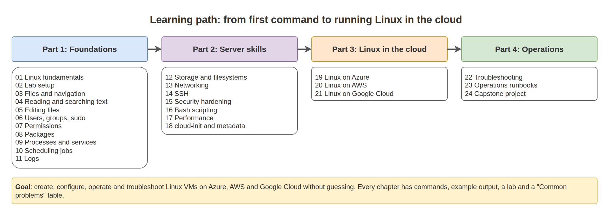

# Linux Essentials for Cloud Engineers

A practical guide to running Linux servers in Azure, AWS, and Google Cloud: creating them, configuring them, operating them day to day, and fixing them when they break. Every topic is explained in plain language and shown with real commands and example output, so you can follow it even if you have never used Linux before.

## What you will be able to do

- Create a Linux VM on Azure, AWS, or Google Cloud from the CLI, with secure defaults
- Connect with SSH, and recover access when SSH fails
- Manage users, permissions, packages, services, scheduled jobs, and logs
- Add, mount, and grow disks, including LVM
- Diagnose network, DNS, firewall, and performance problems layer by layer
- Harden a server and keep it patched
- Automate first-boot setup with cloud-init and routine work with Bash
- Follow runbooks for patching, backups, onboarding, and decommissioning

## Who this is for

- Beginners moving into cloud, DevOps, or infrastructure roles
- Windows or EUC engineers who now look after Linux VMs
- Anyone who wants one place to look things up while working on a Linux server

No prior Linux knowledge is needed. Start at Chapter 01 and work in order. If you already know the basics, use the task map below to jump to what you need.

## Chapters

### Part 1: Foundations

| # | Chapter | You will learn |
|---|---|---|
| 01 | [Linux Fundamentals](01-linux-fundamentals/README.md) | Kernel, shell, distributions, identifying any server, getting help |
| 02 | [Lab Setup](02-lab-setup/README.md) | WSL 2, Multipass, Docker, cloud VMs, SSH on Windows |
| 03 | [Files and Navigation](03-files-and-navigation/README.md) | Directory layout, paths, copying, redirection, pipes, variables |
| 04 | [Reading and Searching Text](04-reading-and-searching-text/README.md) | `less`, `tail -f`, `grep`, `find`, `awk`, `sed`, `tar` |
| 05 | [Editing Files](05-editing-files/README.md) | `nano`, `vim`, safe edits with backup and validation |
| 06 | [Users, Groups, and sudo](06-users-groups-and-sudo/README.md) | Accounts, SSH access for users, sudo rules, service accounts |
| 07 | [Permissions and Ownership](07-permissions-and-ownership/README.md) | `chmod`, `chown`, special bits, ACLs, fixing "Permission denied" |
| 08 | [Package Management](08-package-management/README.md) | `apt` and `dnf`, security updates, automatic updates, repositories |
| 09 | [Processes and Services](09-processes-and-services/README.md) | `ps`, signals, `systemctl`, writing a systemd service |
| 10 | [Scheduling Jobs](10-scheduling-jobs/README.md) | cron, systemd timers, `at` |
| 11 | [Logs](11-logs/README.md) | `journalctl`, `/var/log`, `dmesg`, logrotate |

### Part 2: Server skills

| # | Chapter | You will learn |
|---|---|---|
| 12 | [Storage and Filesystems](12-storage-and-filesystems/README.md) | Data disks, fstab, growing disks, LVM, swap |
| 13 | [Networking](13-networking/README.md) | IPs, routes, DNS, `ss`, `curl`, `nc`, firewalls, `tcpdump` |
| 14 | [SSH](14-ssh/README.md) | Keys, config file, `scp`/`rsync`, jump hosts, hardening, troubleshooting |
| 15 | [Security Hardening](15-security-hardening/README.md) | Baseline checklist, fail2ban, SELinux, AppArmor, auditd, Lynis |
| 16 | [Bash Scripting](16-bash-scripting/README.md) | Variables, conditions, loops, functions, safe scripts, examples |
| 17 | [Performance and Monitoring](17-performance-and-monitoring/README.md) | Load, CPU, memory, disk I/O, OOM, `sar`, cloud limits |
| 18 | [cloud-init and Metadata](18-cloud-init-and-metadata/README.md) | First-boot automation, instance metadata, VM identities |

### Part 3: Linux in the cloud

| # | Chapter | You will learn |
|---|---|---|
| 19 | [Linux on Azure](19-linux-on-azure/README.md) | Create, connect, disks, resize, Run Command, Serial Console, clean up |
| 20 | [Linux on AWS](20-linux-on-aws/README.md) | Launch, EBS on NVMe, IAM roles, Session Manager, Serial Console, rescue |
| 21 | [Linux on Google Cloud](21-linux-on-gcp/README.md) | Create, OS Login, IAP, disks, serial console, clean up |

### Part 4: Operations

| # | Chapter | You will learn |
|---|---|---|
| 22 | [Troubleshooting](22-troubleshooting/README.md) | A method and a playbook for the most common failures |
| 23 | [Operations Runbooks](23-operations-runbooks/README.md) | Build, patch, onboard, extend disks, HTTPS, backup, decommission |
| 24 | [Capstone Project](24-capstone-project/README.md) | Build and operate a production-style server, then break and fix it |

Quick reference: [CHEATSHEET.md](CHEATSHEET.md)

## Task map: "I need to..."

| I need to... | Go to |
|---|---|
| Create a Linux VM in Azure / AWS / GCP | [19](19-linux-on-azure/README.md), [20](20-linux-on-aws/README.md), [21](21-linux-on-gcp/README.md) |
| Fix "I cannot SSH to the server" | [22: Cannot connect with SSH](22-troubleshooting/README.md#cannot-connect-with-ssh) |
| Add and mount a new data disk | [12: Add a data disk](12-storage-and-filesystems/README.md#add-a-data-disk-step-by-step) |
| Grow a full disk | [23: Extend a disk](23-operations-runbooks/README.md#extend-a-disk-that-is-filling-up) |
| Recover a VM stuck at boot after an fstab edit | [22: fstab boot failure](22-troubleshooting/README.md#server-does-not-boot-after-an-fstab-change) |
| Patch a server safely | [23: Patch a server](23-operations-runbooks/README.md#patch-a-server) |
| Run my application as a service | [09: Write your own service](09-processes-and-services/README.md#write-your-own-service) |
| Give a colleague access | [23: Onboard a user](23-operations-runbooks/README.md#onboard-and-offboard-a-user) |
| Find out why the server is slow | [17: The first 60 seconds](17-performance-and-monitoring/README.md#the-first-60-seconds) |
| Fix "Permission denied" | [07: Method](07-permissions-and-ownership/README.md#method-fixing-permission-denied) |
| Configure a VM automatically at creation | [18: cloud-init](18-cloud-init-and-metadata/README.md) |

## Conventions used in this guide

- Examples use **Ubuntu 24.04 LTS**. Where the **Red Hat family** (RHEL, Rocky, AlmaLinux, Amazon Linux 2023) differs, both commands are shown.
- Code blocks labelled `bash` are commands to run. Blocks labelled `text` are example output. Your values (IP addresses, sizes, names, dates) will differ.
- `sudo` is shown wherever a command needs administrator rights.
- Cloud CLI examples use Bash line continuation (`\`). In PowerShell, replace the trailing `\` with a backtick (`` ` ``).
- Placeholders are written like `<server-ip>` or in capitals like `RG`. Replace them with your own values.

## Lab requirements and cost

- Chapters 01 to 11 and 16 work on any Linux shell: WSL 2 on Windows, Multipass, a container, or a small VM.
- Chapters 12 to 15 and 17 to 24 need a real VM. A small cloud VM (Azure `Standard_B2s`, AWS `t3.micro`, GCP `e2-small`) is enough.
- Cloud resources cost money while they exist. Every cloud chapter ends with a **Clean up** section. Run it when you finish, and check your billing page.
- Never open SSH to `0.0.0.0/0`. The labs show how to allow only your own IP address.

## How this guide was tested

- The Linux commands and labs in Chapters 01 to 17 and 22 to 23 were run on Ubuntu 24.04 LTS with systemd, and the example output was compared with the real output. Problems found during testing were fixed in the text. The exceptions are LVM logical volumes, XFS mounts and `auditd`, which the test machine's kernel did not support; their syntax was checked against the man pages.
- The example scripts in Chapter 16 pass `shellcheck` and were run on Ubuntu 24.04.
- The cloud-config in Chapter 18 passes `cloud-init schema` validation.
- Every `az` and `aws` command was checked against the current Azure CLI and AWS CLI, including the extensions the guide uses, so options and syntax are correct.
- `gcloud` commands and Red Hat family commands were checked against the official documentation but not run for this release.

Cloud providers change their CLIs and defaults over time. If a command no longer works, check the provider's current documentation and open an issue.

## Safety

Practise on lab machines. Commands that delete data, reformat disks, change firewall rules, or edit SSH and sudo configuration are marked with warnings. On real servers, follow your organisation's change process and have a rollback plan and console access ready before you start.
